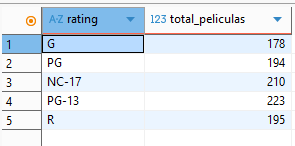
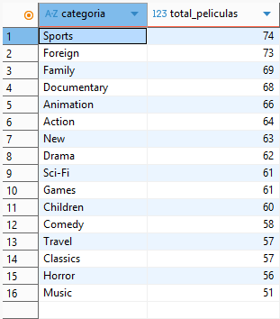

# Proyecto_04 Consultas SQL

## **Resumen del proyecto** ##

Trabajamos con una base de datos de una tienda ficticia de películas. Para ello, vamos a utilizar las siguientes herramientas:
**- PostgreSQL**
**- Dbeaver**

Podremos ver la relación que hay entre las películas y los actores, así como las preferencias de los clientes para alquilar las películas.

## Guía para iniciar el trabajo ##

**Paso 1**
En primer lugar, descargamos la base de datos y los enunciados de las consultas desde la app "The Power".

**Paso 2**
En segundo lugar, una vez descargada la base de datos, vamos al programa Dbeaver e importamos la nueva base de datos. En este caso, la ha llamado "BBDD_proyecto"

**Paso 3**
En tercer lugar, con la base de datos instalada, analizamos las tablas y vemos la relación que hay entre ellas para poder iniciar las consultas.

## Esquema de la base de datos ##

Una vez realizados los puntos anteriores, vemos las tablas que componen nuestra base de datos (imagen 1) y la relación que hay entre ellas (imagen 2).

- Imagen 1: Tablas de la base de datos

- Imagen 2: Relación entre tablas de la base de datos

## Conclusiones ##

Después de haber hecho todas la consultas, podemos concluir lo siguiente: 
- Tenemos una tienda con 1.000 películas para alquilar.
- Las películas se clasifican en:
  
  

- Entre estas 5 clasificaciones, hay 16 géneros distintos:

 

 - La facturación total de la tienda: 67.416,51 €
 